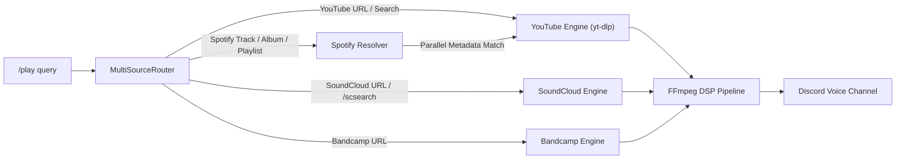

# 🎵 Music Bot Gen 4.0

> **Enterprise-Grade Discord Music Ecosystem** — Studio DSP Audio Engine, Native Multi-Source Streaming (Zero Lavalink), 100% Offline Local Web Dashboard, Voice Democracy, Universal 9-Language Localization, and 679 Automated Tests.

[](https://python.org)
[](https://github.com/Rapptz/discord.py)
[-success?logo=pytest&logoColor=white)](tests/)
[-orange?logo=translate&logoColor=white)](locales/)
[-red?logo=ffmpeg&logoColor=white)](core/audio.py)
[](Dockerfile)
[](LICENSE)

---

## 🚀 The Generational Leap: Gen 1.0 ➔ Gen 4.0

Music Bot Gen 4.0 is not merely an incremental update; it is an architectural transformation into an enterprise-ready music ecosystem:

| Architecture Domain | Gen 1.0 (V1) | Gen 2.0 (V2) | Gen 3.0 (V3) | **Gen 4.0 (Current)** |
|---|---|---|---|---|
| **Audio Sources** | YouTube only | YouTube + Spotify | YouTube + Spotify | **YouTube + Spotify + SoundCloud + Bandcamp** (Multi-Source Router, zero Lavalink) |
| **Audio Processing** | Raw volume | Basic FFmpeg | 18 Audio Effects + Speed/Pitch | **Studio DSP: 18 FX + 4-Band EQ + EBU R128 Loudnorm + L-R Pan + Stereo Widener + Hot-Reload Seek** |
| **Recommendation Engine** | None | Manual Queue | Play-history Auto-playlist | **Smart Autoplay (YouTube Radio Mix Recommendations + Concurrency Semaphore + In-Memory TTL Cache)** |
| **Lyrics & Metadata** | None | None | Basic track title | **Real-Time Synced Lyrics (YouTube Subtitles live line tracking) + Video Chapters Dropdown Navigator** |
| **Web Dashboard** | None | `/health` endpoint only | Read-only Stats HTML + REST v1 | **100% Offline Interactive Web Player + Drag-and-Drop Queue Reordering + Real-Time Bi-Directional WebSocket (`/ws/dashboard`)** |
| **Voice Governance** | Anyone / Admin | Basic DJ Role | DJ Role + Request Channel | **Voice Democracy (`/voteskip`, `/voteshuffle`, `/voteclear` with live progress bars) + Queue Lock / Permissions / Transactions** |
| **Localization (i18n)** | English only | English only | Bilingual (EN + TH) | **Universal 9-Language Parity (`en`, `th`, `zh_cn`, `ja`, `ko`, `es`, `ru`, `fr`, `de`) with 249 identical keys** |
| **Audio Infrastructure** | Basic voice | Lavalink stub + FFmpeg | FFmpeg only | **FFmpeg Warm Process Pool + Self-Healing Voice Reconnect (Zero external audio servers)** |
| **Watchdogs & Resilience** | None | Basic error logs | Crash recovery | **10 Background Watchdogs + Dead-Task Watchdog + Memory Leak Detector + 3-State Circuit Breakers + VPS Anti-Bot Bypass** |
| **Automated Testing** | None | ~50 tests | ~200 tests | **679 Automated Unit & Integration Tests (100% pass rate in ~6.5s)** |

---

## ✨ Gen 4.0 Highlights

| Icon | Core Capability | Architectural Details |
|:---:|---|---|
| 🎛 | **Studio DSP Audio Engine** | 18 audio effects, 4-band frequency equalizer with 8 studio presets, EBU R128 broadcast loudness normalization, pan balance, and stereo soundstage widening. |
| 🌐 | **100% Offline Local Web Dashboard** | Self-contained Vanilla HTML/CSS/JS web player and drag-and-drop queue management with real-time bi-directional WebSocket sync (`/ws/dashboard`). |
| 📻 | **Smart Autoplay & Radio Mix** | Automatically fetches related YouTube mix recommendations when the queue empties, complete with deduplication caching and concurrency throttling. |
| 📜 | **Real-Time Synced Lyrics & Chapters** | Subtitle-based live synced lyrics with interactive paginator and video chapter detection with instant dropdown seek navigation. |
| 🗳️ | **Voice Democracy System** | Quorum-based voting for skipping, clearing, and shuffling with dynamic live progress bar calculation (`ceil(50% of listeners)`). |
| 🌍 | **Universal 9-Language Parity** | 100% translated across 9 global languages (`en`, `th`, `zh_cn`, `ja`, `ko`, `es`, `ru`, `fr`, `de`) with 249 keys and zero missing placeholders. |
| 🛡 | **Enterprise Self-Healing Architecture** | 10 background loop watchdogs, dead-task auto-restarting, memory leak detection, 3-state circuit breakers, and warm FFmpeg process pools. |
| ⚡ | **Zero Third-Party Audio Servers** | No Lavalink, no external proxy bots, no OpenAI/Anthropic token costs. 100% local processing with internal Regex NLU. |

---

## 📁 Project Architecture

The Gen 4.0 codebase is cleanly decomposed into **24 cogs**, **10 dedicated feature packages**, **18 core services**, and **9 localized string catalogues**:

```text
music-bot-v3/
├── main.py                     # Bot entrypoint, 24 cogs loader, 10 background watchdogs
├── config.py                   # Centralized configuration & environment loader (.env)
├── webserver.py                # aiohttp REST API v1 + WebSocket + Dashboard router
├── Dockerfile & docker-compose # Containerized production builds
├── render.yaml                 # One-click Render.com web service configuration
│
├── autoplay/                   # Feature: Smart YouTube Radio Mix recommendations
│   ├── cog.py                  # Slash command: /autoplay (on, off, status)
│   └── service.py              # In-memory TTL cache (1h, 256 size), semaphore & deduplication
│
├── chapters/                   # Feature: Video chapters parser & seamless jumping
│   ├── cog.py                  # Slash commands: /chapters, /chapter_jump, /cjump
│   ├── detector.py             # Description timestamp parser & yt-dlp chapter extractor
│   ├── seek_handler.py         # Hot-reload audio re-attachment at chapter timestamp
│   └── views.py                # Interactive chapter select dropdown menu
│
├── dashboard/                  # Feature: 100% Offline Local Web Dashboard
│   ├── cog.py                  # Slash command: /dashboard
│   ├── routes.py               # REST API endpoints (/api/v1/...) & WebSocket routes
│   ├── service.py              # Dashboard state aggregation & queue mutators
│   ├── templates.py            # Self-contained offline HTML/CSS/JS (no external CDN)
│   └── websocket.py            # Live real-time WebSocket connection manager (/ws/dashboard)
│
├── equalizer/                  # Feature: 4-Band Frequency Equalizer
│   ├── cog.py                  # Slash commands: /equalizer, /eq (preset, custom, view, reset)
│   └── presets.py              # 8 Studio presets (flat, rock, electronic, vocal, bass_boost, etc.)
│
├── loop_ab/                    # Feature: Loop A-B segment repetition
│   ├── cog.py                  # Slash commands: /loopab, /loopab_off
│   └── service.py              # Sub-second loop timer worker & automatic boundary seek
│
├── loudnorm/                   # Feature: EBU R128 Smart Loudness Normalization
│   ├── cog.py                  # Slash command: /loudnorm
│   └── filter.py               # Dual-pass EBU R128 broadcast filtergraph generator
│
├── lyrics/                     # Feature: YouTube subtitle-based synced lyrics
│   ├── cog.py                  # Slash command: /lyrics (with sync & paginator)
│   ├── parser.py               # WebVTT / SRT subtitle timestamp parser & active line tracker
│   └── service.py              # Subtitle stream resolution & caching
│
├── pan/                        # Feature: Audio pan & stereo soundstage enhancer
│   ├── cog.py                  # Slash commands: /pan, /stereowide
│   └── filter.py               # FFmpeg pan balance & extrastereo widening filter builder
│
├── seek/                       # Feature: Hot-reload audio seeking
│   ├── cog.py                  # Slash commands: /seek, /forward, /rewind, /replay, /restart
│   ├── parser.py               # Human timestamp parser (HH:MM:SS, MM:SS, seconds, 1m30s)
│   └── service.py              # Seamless FFmpeg hot-reload keeping queue & filter state
│
├── sources/                    # Feature: Native multi-source streaming
│   ├── bandcamp.py             # Native Bandcamp track & album extractor
│   ├── cog.py                  # Slash command: /scsearch & extended /play routing
│   ├── router.py               # MultiSourceRouter (YouTube, Spotify, SoundCloud, Bandcamp)
│   └── soundcloud.py           # Native SoundCloud track, set & search extractor
│
├── cogs/                       # 14 Standard Discord Slash Cogs
│   ├── music.py                # /play, /playnext, /search, /pause, /resume, /skip, /stop, /nowplaying
│   ├── queue_cog.py            # /queue, /shuffle, /voteskip, /voteshuffle, /voteclear, /undo, /jump
│   ├── effects.py              # /volume, /effects, /effects_list, /effects_clear, /quality
│   ├── playback_cog.py         # /speed, /pitch, /crossfade, /silencetrim, /replaygain, /playbackinfo
│   ├── favorites.py            # /favorite add, list, play, remove
│   ├── bookmark_cog.py         # /bookmark save, load, list, delete (queue snapshots)
│   ├── presets_cog.py          # /preset load, save, list, delete (audio & effect bundles)
│   ├── theme_cog.py            # /theme, /themeinfo (Classic, Spotify, Minimal, Glass)
│   ├── sleep_timer_cog.py      # /sleep, /sleepstatus (auto-disconnect countdown)
│   ├── language_cog.py         # /language, /languageinfo (per-guild 9-language switching)
│   ├── analytics_cog.py        # /analytics heatmap, genre, peak, top, streak
│   ├── health_cog.py           # /health, /cacheinfo (system diagnostics)
│   ├── info.py                 # /history, /stats, /botstats, /help
│   └── admin.py                # /djset, /requestchannel, /autoplaylist, /idletimeout
│
├── core/                       # Core Audio, Database & Stability Engine (18 modules)
│   ├── audio.py                # AudioEffectsProcessor (9-stage FFmpeg filtergraph pipeline)
│   ├── audio_backend.py        # FFmpegBackend (play/stop abstractions)
│   ├── circuit_breaker.py      # 3-state circuit breaker (CLOSED / OPEN / HALF-OPEN)
│   ├── database.py             # aiosqlite (WAL mode) — queues, history, favorites, config
│   ├── ffmpeg_pool.py          # Pre-warmed FFmpeg processes for instant playback start
│   ├── i18n.py                 # 9-Language localization engine with fallback resolution
│   ├── lru_cache.py            # LRU caches with automatic memory pressure eviction
│   ├── media_cache.py          # Background thumbnail prewarming & metadata refresh
│   ├── metrics.py              # Runtime metrics collector (5-minute snapshots)
│   ├── nlu.py                  # Regex NLU engine (EN + TH, 10 intents, zero API cost)
│   ├── player.py               # GuildPlayer — queue, loop, volume, prefetch, audio filters
│   ├── self_test.py            # Startup self-test suite (database, audio, dependencies)
│   ├── spotify.py              # Spotify parallel track/album resolver
│   ├── stability.py            # 3-tier Exception taxonomy, DeadTaskWatchdog, MemoryLeakDetector
│   ├── startup_validator.py    # Pre-login environment and dependency validator
│   ├── validator.py            # 7-stage URL and query safety validator
│   └── youtube.py              # yt-dlp wrapper with stream caching and pre-fetching
│
├── locales/                    # 9-Language Parity (249 keys each)
│   └── de/ en/ es/ fr/ ja/ ko/ ru/ th/ zh_cn/
├── models/                     # Enums, Track, and ServerConfig dataclasses
├── tests/                      # 679 Automated tests (test_autoplay, test_dashboard, test_seek, etc.)
└── utils/                      # Embed factories, Voice voting views, ColorThief, formatters
```

---

## 🖼 Discord UI Experience

### 1. Gen-2 Now Playing Embed
```text
🎵  Awesome Song Title — Example Artist Official MV         [thumbnail]
🔵  Example Channel

⏱ Duration        👁 Views          📋 In Queue
3:31               1.3M              0 tracks

👤 Requested by    🔁 Loop           🔊 Volume
@Username          Loop: Off         100%

▶️ Progress
▶️ [──────●](url)────────────────────── [0:58/3:31] 🔉

──────────────────────────────────────────────────────────
[bot avatar]  Music Bot Gen 4.0  •  Now Playing
```

> **Two-Tone Accent Progress Bar (Width=32):**  
> The filled segment and the knob `●` are wrapped in a Markdown link `[──────●](url)`, prompting Discord to render them in accent/link color, while remaining segments stay grey. Progress is calculated with full precision against track duration and auto-refreshes every **7 seconds**.

---

### 2. Dual-Row Interactive Controls (`MusicControlView`)

Underneath the now-playing embed, the bot displays a full 10-button interactive control bar:

| Row | Buttons & Behaviors |
|:---:|---|
| **Row 0** | `⏸/▶ Pause/Resume` · `⏭ Skip` · `🔁 Loop: Off/Track/Queue` · `🔀 Shuffle` · `⏹ Stop` |
| **Row 1** | `⏪ -15s Rewind` · `⏩ +15s Forward` · `🔇 -10% Vol` · `🔊 +10% Vol` · `❤️ Favorite` |

- **Non-Destructive Stop:** `/stop` or clicking `⏹ Stop` halts playback and clears the queue while keeping the bot inside the voice channel. Use `/leave` to disconnect.
- **State Synchronization:** The loop button dynamically updates its label and icon to reflect current loop mode (`🔁 Loop: Off` ➔ `🔂 Loop: Track` ➔ `🔁 Loop: Queue`).

---

### 3. Voice Democracy (Democratic Voting)

When non-DJ users request destructive actions, the bot initiates democratic voice voting:

```text
🗳️  Vote to Skip Track
A vote has been started to skip Awesome Song Title.

[████████░░░░░░░░] 3/5 votes (60%)
Threshold: 3 votes required (50% of listeners)

[ ✅ Vote Skip ]  [ ❌ Cancel ]
```

- **Supported Votes:** `/voteskip` (Vote Skip), `/voteshuffle` (Vote Shuffle), and `/voteclear` (Vote Clear).
- **Dynamic Quorum:** Threshold is calculated dynamically as $\lceil \text{listeners} \times 0.5 \rceil$ (ignoring deafened/bot accounts).

---

### 4. Interactive Components (Chapters & Synced Lyrics)

- **Video Chapters Navigator (`/chapters`):** A select menu dropdown displaying all chapters detected from YouTube metadata or video descriptions. Selecting a chapter triggers a hot-reload seek directly to that section.
- **Synced Lyrics Display (`/lyrics`):** A paginated interactive embed displaying synchronized lyrics. The currently playing line is highlighted with `▶ [MM:SS] **Text**`, completed lines are dimmed, and a `🔄 Sync` button auto-scrolls to the current playback position.

---

## 🎧 Multi-Source Audio Engine

Music Bot Gen 4.0 features a unified, zero-Lavalink audio routing architecture supporting four major platforms:



| Source | Playback Types | Resolution Details |
|---|---|---|
| **YouTube** | Videos, Playlists, Livestreams, Radio Mixes | Direct stream extraction, LRU stream cache (30 min TTL), predictive prefetch (~15s early). |
| **Spotify** | Tracks, Albums, Playlists | Parallel batch metadata resolver matching title and artist to highest-quality streams. |
| **SoundCloud** | Tracks, Sets, Search (`/scsearch`) | Native extractor streaming directly with interactive dropdown selection. |
| **Bandcamp** | Tracks, Full Discographies | Native stream extraction with metadata and album artwork retention. |

### 🛡️ VPS Anti-Bot & 429 Bypass (Feature 1.6)
Running a Discord music bot on a VPS or cloud provider often triggers YouTube IP blocks (HTTP 429) or bot verification prompts. Gen 4.0 includes built-in countermeasures:
1. **Cookie File (`YTDL_COOKIE_FILE`):** Point to a standard Netscape-format `cookies.txt` exported from a web browser to authenticate stream requests. Safe to leave default; loaded only if the file exists on disk.
2. **Proof-of-Origin Token (`YTDL_PO_TOKEN`):** Provide a YouTube PO-Token to authenticate playback sessions and bypass anti-bot challenges entirely.

---

## 🎛 Studio DSP Audio Filtergraph Pipeline

Every audio stream passes through `AudioEffectsProcessor` which compiles a single, seamless FFmpeg filtergraph:

```text
Raw Stream
    │
    ▼ [1. Silence Trim]          silenceremove (intro/outro silence strip)
    │
    ▼ [2. Equalizer]             equalizer (4-band or 10-band custom / presets)
    │
    ▼ [3. Pan & Soundstage]      pan (L-R balance) & extrastereo (widening)
    │
    ▼ [4. Speed Control]         atempo chain (0.1× to 10.0× speed preservation)
    │
    ▼ [5. Pitch Shift]           asetrate + aresample + atempo (semitone shifting)
    │
    ▼ [6. 18 DSP Audio FX]       bass, nightcore, 8D, vaporwave, reverb, chorus...
    │
    ▼ [7. Volume Scaling]        volume=X.XX (0% to 200% linear control)
    │
    ▼ [8. Loudness Normalizer]   dynaudnorm (ReplayGain) OR loudnorm (EBU R128)
    │
    ▼ [9. Seamless Crossfade]    afade (smooth track-to-track fade transitions)
    │
    ▼
PCM Output (48 kHz, 16-bit Stereo) ➔ Discord Voice Gateway
```

### 1. 18 Built-in Audio Effects (`/effects <name>`)
Apply and stack real-time audio transformations on the fly:
- **Bass Boost:** `bass=g=15,dynaudnorm`
- **Nightcore:** `asetrate=48000*1.25,aresample=48000,atempo=1.06`
- **Vaporwave:** `asetrate=48000*0.8,aresample=48000,atempo=1.1`
- **8D Audio:** `apulsator=hz=0.125` (smooth circular panning)
- **Vocal Boost:** `afftfilt=real='re * (f >= 300 && f <= 3000)'`
- **Karaoke:** `pan=mono|c0=0.5*c0+-0.5*c1` (center vocal phase inversion)
- **Echo / Reverb / Chorus / Vibrato / Tremolo / Distortion / Treble Boost / Mono / Stereo Enhance / Compressor / Limiter / Noise Gate**

### 2. 4-Band Studio Equalizer (`/equalizer`, `/eq`)
Control frequency bands independently (-10.0 dB to +10.0 dB):
- **Bass:** Low-shelf at 100 Hz
- **Mid-Low:** Peaking filter at 500 Hz
- **Mid-High:** Peaking filter at 2500 Hz
- **Treble:** High-shelf at 8000 Hz
- **8 Built-in Presets:** `flat`, `bass_boost`, `vocal`, `treble_boost`, `rock`, `electronic`, `rnb`, `classical`.

### 3. EBU R128 Smart Loudness Normalization (`/loudnorm`)
Broadcast-standard loudness normalization (`loudnorm=I=-16:TP=-1.5:LRA=11`) eliminating volume jumps between quiet acoustic tracks and compressed modern masters without clipping or distortion.

### 4. Pan Balance & Stereo Soundstage (`/pan`, `/stereowide`)
- `/pan <balance>`: Shift audio weight from full left (`-1.0`) to center (`0.0`) to full right (`+1.0`).
- `/stereowide <width>`: Expand acoustic soundstage from Mono (`0.0x`), Narrow (`0.5x`), Normal (`1.0x`), Wide (`1.5x`), to Ultra-Wide (`2.0x`).

### 5. Loop A-B Segment Repeat (`/loopab`)
Loop any specific segment within a song with millisecond accuracy (e.g., `/loopab 1:15 2:05`). Playback repeats seamlessly between timestamps until toggled off via `/loopab off` or when the track finishes.

---

## 🌐 Local Offline Web Dashboard & REST API v1

Music Bot Gen 4.0 provides a self-contained local web dashboard served directly on `WEB_HOST:WEB_PORT` (default `http://localhost:8080`).

### ⚡ 100% Offline Architecture
The web player requires **zero external network requests or third-party CDNs**. CSS fonts and JavaScript controllers are embedded directly into the application, ensuring full operation in isolated intranets, air-gapped networks, or private home labs.

### 🎛 Interactive Web Features
- **Live Player Controls:** Play, pause, skip, interactive seekbar, and volume slider (0–200%).
- **Drag-and-Drop Queue:** Reorder pending songs in real time using native HTML5 drag-and-drop.
- **Search & Add:** Search tracks and add them directly to the active queue from your browser.
- **Real-Time WebSockets:** Bi-directional state synchronization via `/ws/dashboard` ensuring instantaneous UI updates when Discord users execute commands.

### 📡 REST API Endpoints

All endpoints support optional authentication via `API_SECRET` (`Authorization: Bearer <token>` or `?token=<secret>`).

| Method | Endpoint | Description |
|:---:|---|---|
| `GET` | `/` or `/dashboard` | Self-contained HTML/CSS/JS dashboard UI |
| `GET` | `/health` | Bot health status check (`{"status":"ok"}`) |
| `GET` | `/status` | Full bot JSON status snapshot (players, uptime, circuits) |
| `GET` | `/ready` | Kubernetes/Docker readiness probe (200 OK or 503) |
| `WS` | `/ws/dashboard` | Real-time bi-directional player state & queue WebSocket |
| `WS` | `/ws/stats` | Real-time bot metrics push stream (every 5 seconds) |
| `GET` | `/api/v1/guilds` | List of active connected guilds |
| `GET` | `/api/v1/guild/{id}/state` | Full playback state (track, progress, volume, queue) |
| `POST` | `/api/v1/guild/{id}/pause` | Pause current playback |
| `POST` | `/api/v1/guild/{id}/resume` | Resume paused playback |
| `POST` | `/api/v1/guild/{id}/skip` | Skip current track |
| `POST` | `/api/v1/guild/{id}/volume` | Set playback volume (`{"volume": 100}`) |
| `POST` | `/api/v1/guild/{id}/seek` | Seek to position in seconds (`{"position": 120}`) |
| `POST` | `/api/v1/guild/{id}/queue/move` | Atomically move track (`{"from_index": 2, "to_index": 0}`) |
| `DELETE` | `/api/v1/guild/{id}/queue/{index}` | Remove a track from the queue |
| `POST` | `/api/v1/guild/{id}/queue/clear` | Clear the entire queue |
| `POST` | `/api/v1/guild/{id}/queue/shuffle` | Shuffle the queue |
| `POST` | `/api/v1/guild/{id}/loop` | Set loop mode (`off`, `track`, `queue`) |
| `POST` | `/api/v1/guild/{id}/effects` | Toggle audio effect |
| `GET` | `/api/v1/search?q=query` | Search tracks across supported sources |
| `POST` | `/api/v1/guild/{id}/queue/add` | Enqueue a new track via query or URL |

---

## 🎛 Comprehensive Slash Command Reference

Music Bot Gen 4.0 provides over **40 slash commands** organized into 9 specialized domains:

### 1. 🎵 Core Playback
| Command | Arguments | Description |
|---|---|---|
| `/play` | `query: str`, `[shuffle: bool]` | Play from YouTube, Spotify, SoundCloud, Bandcamp, or search terms. |
| `/playnext` | `query: str` | Prioritize and enqueue a song directly after the currently playing track. |
| `/search` | `query: str` | Search YouTube and select a track from an interactive dropdown menu. |
| `/pause` | — | Pause audio playback. |
| `/resume` | — | Resume paused playback. |
| `/skip` | — | Skip current song (instant for DJ/Admin; starts vote for users). |
| `/stop` | — | Stop playback and clear the queue (bot remains connected in channel). |
| `/nowplaying` | — | Display the Gen-2 Now Playing embed with live two-tone progress bar. |
| `/join` | — | Join the user's current voice channel. |
| `/leave` | — | Disconnect the bot from voice and clear the queue. |

### 2. 🗳️ Democratic Voice Voting
| Command | Description |
|---|---|
| `/voteskip` | Start a democratic vote to skip the current track. |
| `/voteshuffle` | Start a democratic vote to shuffle the server queue. |
| `/voteclear` | Start a democratic vote to clear all songs from the queue. |

### 3. 📋 Queue Operations & Control
| Command | Arguments | Description |
|---|---|---|
| `/queue` | `[page: int]` | View the paginated server queue with total duration. |
| `/shuffle` | — | Randomize the order of tracks in the queue. |
| `/clear` | — | Clear all tracks from the queue (DJ/Admin). |
| `/loop` | — | Cycle loop mode: `Off` ➔ `Track` ➔ `Queue`. |
| `/remove` | `position: int` | Remove a track by its 1-based queue position. |
| `/move` | `from_pos: int`, `to_pos: int` | Atomically reposition a track within the queue. |
| `/jump` | `position: int` | Jump directly to a track number in queue, skipping intermediate tracks. |
| `/undo` | — | Undo the last queue modification (shuffle, clear, remove, or move). |
| `/qsearch` | `query: str` | Search for a specific song inside the active queue. |
| `/qhistory` | `[limit: int]` | View recently played tracks with one-click replay buttons. |
| `/queuelock` | `locked: bool` | Lock the queue to prevent non-DJ/Admins from adding tracks. |
| `/queueperm` | `level: str` | Configure who can add tracks (`all`, `dj`, `admin`). |
| `/duplicates` | `mode: str` | Configure duplicate track handling (`allow`, `warn`, `block`). |
| `/qexport` | `[fmt: json\|csv\|txt]` | Export the current server queue to a downloadable file. |
| `/qimport` | `[mode: append\|replace]` | Import a previously saved queue file. |

### 4. ⏩ Seeking & Looping
| Command | Arguments | Description |
|---|---|---|
| `/seek` | `time: str` | Seek to a timestamp (e.g. `1:30`, `90`, `1m20s`, `01:15:00`). |
| `/forward` | `[seconds: int]` | Fast-forward current playback by seconds (default: 15s). |
| `/rewind` | `[seconds: int]` | Rewind current playback by seconds (default: 15s). |
| `/replay` / `/restart` | — | Restart the currently playing track from the beginning. |
| `/loopab` | `start: str`, `[end: str]` | Repeat a segment between timestamps (e.g. `/loopab 0:30 1:15`). |
| `/loopab_off` | — | Stop active Loop A-B repetition. |

### 5. 📑 Chapters, Lyrics & Recommendations
| Command | Arguments | Description |
|---|---|---|
| `/chapters` | — | Browse and jump to video chapters via an interactive dropdown menu. |
| `/chapter_jump` / `/cjump` | `time: str` | Jump directly to a video chapter timestamp. |
| `/lyrics` | `[sync: bool]` | Display synchronized lyrics with interactive paginator and live line tracking. |
| `/autoplay` | `mode: on\|off\|status` | Toggle Smart Autoplay (YouTube Radio Mix recommendations). |

### 6. 🔊 Multi-Source Search
| Command | Arguments | Description |
|---|---|---|
| `/scsearch` | `query: str` | Search SoundCloud and select tracks via interactive dropdown. |

### 7. 🎚 Audio DSP, Equalizer & Soundstage
| Command | Arguments | Description |
|---|---|---|
| `/volume` | `volume: 0–200` | Adjust playback volume percentage. |
| `/effects` | `name: str` | Toggle one of 18 audio effects (autocomplete supported). |
| `/effects_list` | — | Show all 18 effects with their active/inactive status. |
| `/effects_clear` | — | Disable all active audio effects simultaneously. |
| `/quality` | `preset: str` | Set audio quality: `low`, `medium`, `high`, `ultra`. |
| `/equalizer` / `/eq` | `subcommand: ...` | 4-Band Equalizer: `preset <name>`, `custom <b m1 m2 t>`, `view`, `reset`. |
| `/loudnorm` | `[enabled: bool]` | Toggle EBU R128 smart broadcast loudness normalization. |
| `/pan` | `balance: float` | Adjust audio balance from full left (`-1.0`) to full right (`+1.0`). |
| `/stereowide` | `width: float` | Set stereo soundstage width: Mono (`0.0x`) to Ultra-Wide (`2.0x`). |
| `/speed` | `rate: float` | Set playback speed (0.75× to 2.0×) without pitch changes. |
| `/pitch` | `semitones: int` | Shift pitch (-2 to +2 semitones) without tempo changes. |
| `/crossfade` | `duration: int` | Set track crossfade duration (0s, 3s, 5s, 8s). |
| `/silencetrim` | — | Toggle automatic silence trimming from track intro and outro. |
| `/replaygain` | — | Toggle dynamic audio loudness normalization (`dynaudnorm`). |
| `/playbackinfo` | — | Display all active audio enhancement and DSP settings. |

### 8. 🎨 Customization, Favorites & Presets
| Command | Arguments | Description |
|---|---|---|
| `/favorite add` | `[name: str]` | Save the currently playing track to your personal favorites (up to 50). |
| `/favorite list` | `[user: member]` | Browse your (or another user's) saved favorite tracks. |
| `/favorite play` | `name: str` | Enqueue a saved favorite with fuzzy title matching. |
| `/favorite remove`| `name: str` | Delete a saved track from your favorites. |
| `/bookmark save` | `name: str` | Create a named snapshot of the current queue. |
| `/bookmark load` | `name: str`, `[mode]` | Restore a queue snapshot (`append` or `replace`). |
| `/bookmark list` | — | List all saved bookmarks for this server. |
| `/bookmark delete`| `name: str` | Delete a saved queue bookmark. |
| `/preset load` | `name: str` | Load a bundled audio preset (Gaming, Study, Anime, Chill, or custom). |
| `/preset save` | `name: str` | Save current audio/effects settings as a guild preset. |
| `/preset list` | — | List all available built-in and guild presets. |
| `/preset delete` | `name: str` | Delete a custom guild preset (Admin only). |
| `/theme` | `name: str` | Set server embed theme: `classic`, `spotify`, `minimal`, `glass`. |
| `/themeinfo` | — | Preview all 4 visual embed themes. |
| `/sleep` | `duration: str` | Set an auto-disconnect timer (e.g. `20m`, `1h`, `1h30m`, `off`). |
| `/sleepstatus` | — | View remaining time on the active sleep timer. |
| `/language` | `locale: str` | Switch UI language across 9 supported languages. |
| `/languageinfo` | — | Display current language and list all supported locales. |

### 9. ⚙️ Administration & Diagnostics
| Command | Arguments | Description |
|---|---|---|
| `/djset role` | `role: Role` | Restrict control commands to a specific DJ role. |
| `/djset clear` | — | Remove DJ role requirement (allow all members to control). |
| `/requestchannel set` | `channel: Text` | Designate a text channel for NLU-powered song requests. |
| `/requestchannel clear`| — | Remove dedicated request channel. |
| `/autoplaylist` | `mode: on\|off` | Toggle auto-enqueue from history when queue empties. |
| `/idletimeout` | `seconds: int` | Configure idle auto-disconnect timeout (60–3600 seconds). |
| `/history` | `[user: member]` | Show recent play history for the server or a member. |
| `/stats` | `[user: member]` | Show listening statistics: tracks requested and listening time. |
| `/botstats` | — | Display bot metrics: guilds, active players, memory, and circuits. |
| `/health` | — | Full diagnostic report: caches, memory, self-test status, and circuit breakers. |
| `/cacheinfo` | — | Detailed statistics on LRU caches, hit rates, and evictions. |
| `/help` | — | Interactive command guide and documentation. |

---

## 🌍 Universal 9-Language Localization (i18n)

Music Bot Gen 4.0 achieves **100% translation parity across 9 major global languages**. Every language catalogue contains an identical set of **249 localized keys** with matching string formatting placeholders:

| Flag | Language | Locale Code | Aliases | Key Count | Parity Status |
|:---:|---|:---:|---|:---:|:---:|
| 🇺🇸 | **English** (Default) | `en` | `en-us`, `en-gb` | 249 | 100% Complete |
| 🇹🇭 | **Thai** | `th` | `th-th` | 249 | 100% Complete |
| 🇨🇳 | **Chinese (Simplified)**| `zh_cn` | `zh`, `zh-cn`, `zh_hans` | 249 | 100% Complete |
| 🇯🇵 | **Japanese** | `ja` | `ja-jp` | 249 | 100% Complete |
| 🇰🇷 | **Korean** | `ko` | `ko-kr` | 249 | 100% Complete |
| 🇪🇸 | **Spanish** | `es` | `es-es` | 249 | 100% Complete |
| 🇷🇺 | **Russian** | `ru` | `ru-ru` | 249 | 100% Complete |
| 🇫🇷 | **French** | `fr` | `fr-fr` | 249 | 100% Complete |
| 🇩🇪 | **German** | `de` | `de-de` | 249 | 100% Complete |

Change the language for your server at any time using:
```bash
/language locale:ja      # Switches server to Japanese
/language locale:th      # Switches server to Thai
/language locale:en      # Switches server to English
```

---

## ⚙️ Configuration & Environment Variables

Copy `.env.example` to `.env` and configure your settings:

### 1. Required Credentials
| Variable | Description |
|---|---|
| `DISCORD_TOKEN` | Bot authentication token from the [Discord Developer Portal](https://discord.com/developers/applications). |
| `APP_ID` | Application / Client ID of your bot. |

### 2. Optional Integrations
| Variable | Default | Description |
|---|---|---|
| `SPOTIFY_CLIENT_ID` | *(empty)* | Spotify Developer Client ID (leave empty to disable Spotify). |
| `SPOTIFY_CLIENT_SECRET` | *(empty)* | Spotify Developer Client Secret. |
| `DATABASE_PATH` | `data/musicbot.db` | SQLite database file location (WAL mode enabled automatically). |
| `SYNC_COMMANDS` | `false` | Sync slash commands on startup (set to `true` once after command edits). |
| `AUTO_RESUME` | `false` | Restore queue, loop mode, volume, and playback state after restart. |
| `IDLE_TIMEOUT` | `300` | Seconds before auto-disconnecting from empty voice channels. |
| `SKIP_ERROR_LIMIT` | `5` | Maximum consecutive broken-track skips before stopping. |
| `DEV_LOG_CHANNEL_IDS` | *(empty)* | Comma-separated Discord channel IDs for error traceback forwarding. |

### 3. Smart Autoplay & Queue Settings
| Variable | Default | Description |
|---|---|---|
| `SMART_AUTOPLAY` | `false` | Enable YouTube Radio Mix recommendations when queue empties. |
| `SMART_AUTOPLAY_FETCH_SIZE` | `8` | Number of related tracks to resolve per recommendation seed. |
| `SMART_AUTOPLAY_HISTORY_SIZE`| `100` | Rolling deduplication history to prevent repeating songs. |
| `AUTO_PLAYLIST` | `false` | Fallback: fill queue from recent server play history when empty. |
| `AUTO_PLAYLIST_SIZE` | `5` | Number of history tracks to enqueue in auto-playlist mode. |
| `MAX_FAVORITES_PER_USER` | `50` | Maximum number of favorite tracks stored per user. |
| `MAX_QUEUE_SIZE` | `500` | Maximum tracks allowed in a single server queue. |
| `MAX_PLAYLIST_TRACKS` | `100` | Maximum tracks imported from a single playlist URL. |
| `MAX_TRACK_LENGTH` | `7200` | Maximum track duration allowed in seconds (2 hours). |
| `QUEUE_SAVE_INTERVAL` | `300` | Periodic queue state persistence interval (seconds). |

### 4. Audio, Network & VPS Anti-Bot Bypass
| Variable | Default | Description |
|---|---|---|
| `YTDL_COOKIE_FILE` | `cookies.txt` | Path to Netscape-format cookie file exported from a browser. |
| `YTDL_PO_TOKEN` | *(empty)* | YouTube Proof-of-Origin token for bypassing bot verification. |
| `YTDL_AUDIO_FORMAT` | `bestaudio[ext=webm]/bestaudio/best` | Target audio format selector for yt-dlp. |
| `YTDL_RETRIES` | `3` | Maximum yt-dlp extraction retry attempts. |
| `YTDL_TIMEOUT` | `30.0` | Network timeout for extraction jobs (seconds). |
| `YTDL_STREAM_TIMEOUT` | `20.0` | Connection timeout when initiating stream (seconds). |
| `YTDL_CACHE_TIMEOUT` | `1800.0` | Stream URL LRU cache TTL (30 minutes). |
| `SEARCH_CACHE_TTL` | `600.0` | Search result LRU cache TTL (10 minutes). |
| `EXTRACT_CONCURRENCY` | `3` | Maximum concurrent yt-dlp single-track extraction tasks. |
| `PLAYLIST_EXTRACT_CONCURRENCY`| `2` | Maximum concurrent playlist extraction workers. |
| `COLOR_EXTRACT_CONCURRENCY` | `3` | Maximum concurrent thumbnail dominant color extraction tasks. |

### 5. Web Dashboard & Security
| Variable | Default | Description |
|---|---|---|
| `WEB_HOST` | `0.0.0.0` | Local dashboard server bind address. |
| `WEB_PORT` | `8080` | Local dashboard HTTP and WebSocket port. |
| `API_SECRET` | *(empty)* | Bearer token for REST API & Dashboard authentication (empty = no auth). |
| `API_RATE_LIMIT` | `60` | Maximum REST API requests per minute per IP. |

### 6. Stability & Self-Healing
| Variable | Default | Description |
|---|---|---|
| `CIRCUIT_BREAKER_THRESHOLD` | `5` | Consecutive failures before opening circuit breaker. |
| `CIRCUIT_BREAKER_WINDOW` | `60.0` | Circuit breaker recovery cooldown window (seconds). |
| `RECONNECT_ATTEMPTS` | `3` | Maximum voice reconnection retry attempts. |
| `RECONNECT_BASE_DELAY` | `2.0` | Exponential backoff base delay for voice reconnection. |
| `NLU_ENABLED` | `true` | Enable built-in Regex NLU in designated request channels. |

---

## 🚀 Installation & Deployment

### Method 1: Local / Native Setup

#### Prerequisites
- **Python 3.12+** (tested up to Python 3.14.2)
- **FFmpeg** installed and accessible on system `PATH` ([Download FFmpeg](https://ffmpeg.org/download.html))

```bash
# 1. Clone repository
git clone https://github.com/Punk1107/music-bot-v3.git
cd music-bot-v3

# 2. Create virtual environment
python -m venv venv
source venv/bin/activate       # On Windows: venv\Scripts\activate

# 3. Install dependencies
pip install -r requirements.txt

# 4. Configure environment
cp .env.example .env
# Edit .env and fill in DISCORD_TOKEN and APP_ID

# 5. Launch Music Bot Gen 4.0
python main.py
```

---

### Method 2: Docker & Docker Compose

Deploy instantaneously using the pre-configured production Docker container (Python 3.12-slim + FFmpeg):

```bash
# 1. Configure secrets
cp .env.example .env
nano .env

# 2. Build and launch container in background
docker compose up -d --build

# 3. Monitor live logs
docker compose logs -f
```

---

### Method 3: One-Click Render.com Deployment

The repository includes a ready-to-deploy [`render.yaml`](render.yaml) blueprint:
1. Fork or push this repository to your GitHub account.
2. In the [Render Dashboard](https://dashboard.render.com/), choose **New ➔ Blueprint**.
3. Select your repository. Render will automatically build the Docker service and expose the local dashboard port (`8080`).
4. Set `DISCORD_TOKEN` and `APP_ID` in the Environment variables panel.

---

## 🛡️ Enterprise Stability & 679-Test Suite

### 1. 10 Background Loop Watchdogs
Music Bot Gen 4.0 runs 10 background tasks that continuously maintain bot health and recover from anomalies:

| Task Loop | Interval | Architectural Purpose |
|---|:---:|---|
| `_idle_check` | 30 s | Automatically disconnects idle voice channels and prunes inactive players. |
| `_queue_save` | 5 min | Persists server queues to SQLite WAL (also saves on every enqueue). |
| `_np_refresh` | 7 s | Smoothly updates the now-playing embed's two-tone progress bar. |
| `_cache_prune` | 30 min | Evicts expired yt-dlp stream URLs, search results, and media caches. |
| `_analytics_prune` | 24 h | Prunes listening analytics records older than 30 days. |
| `_session_heartbeat` | 60 s | Saves full player states (queue, volume, loop, effects, position) to disk. |
| `_memory_pressure` | 60 s | Monitors process RSS; automatically flushes LRU caches if memory limits are reached. |
| `_metrics_snapshot` | 5 min | Records CPU, memory, active players, and throughput snapshots. |
| `_memory_leak_detect` | 30 min | Profiles object allocations and thread count to warn on anomalous growth. |
| `_dead_task_watchdog` | 60 s | Inspects all asyncio tasks; automatically restarts crashed background loops. |

---

### 2. Automated Test Suite (679 Tests Passed)
The codebase includes a comprehensive automated test suite covering unit tests, property-based tests (Hypothesis), concurrency simulations, and 100% translation parity verification:

```bash
# Run complete test suite
python -m pytest

# Run with execution timings
python -m pytest --durations=10
```

```text
============================= test session starts =============================
platform win32 -- Python 3.14.2, pytest-9.0.2, pluggy-1.6.0
collected 679 items

tests/test_autoplay.py ............................                      [  4%]
tests/test_bugfixes.py ............                                      [  5%]
tests/test_bugfixes_round2.py ............                               [  7%]
tests/test_bugfixes_round3.py ..............                             [  9%]
tests/test_chapters.py .                                                 [  9%]
tests/test_dashboard.py .......................                          [ 13%]
tests/test_filtergraph_round2.py .....................                   [ 16%]
tests/test_i18n.py ..................................................... [ 24%]
........................................................................ [ 79%]
tests/test_perf_stability_i18n.py ...................................... [ 86%]
tests/test_playnext.py ........                                          [ 87%]
tests/test_seek.py ..................................................... [ 96%]
tests/test_shuffle.py ......                                             [ 97%]
tests/test_voice_voting.py ....................                          [100%]

====================== 679 passed, 10 warnings in 6.59s =======================
```

---

## 📄 License & Attribution

Distributed under the **MIT License**. See [`LICENSE`](LICENSE) for complete terms.

Built with ❤️ by the community. Empowered by [discord.py](https://github.com/Rapptz/discord.py), [yt-dlp](https://github.com/yt-dlp/yt-dlp), and [FFmpeg](https://ffmpeg.org/).
